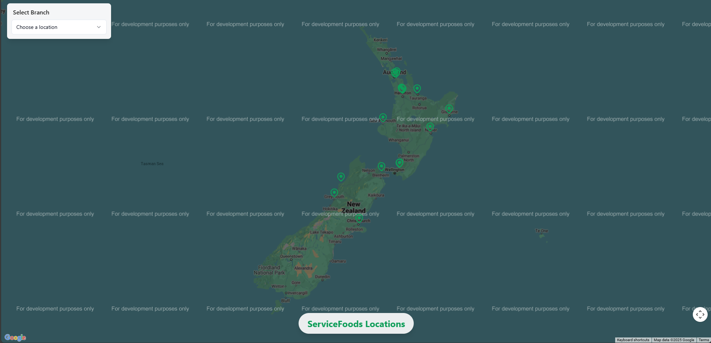
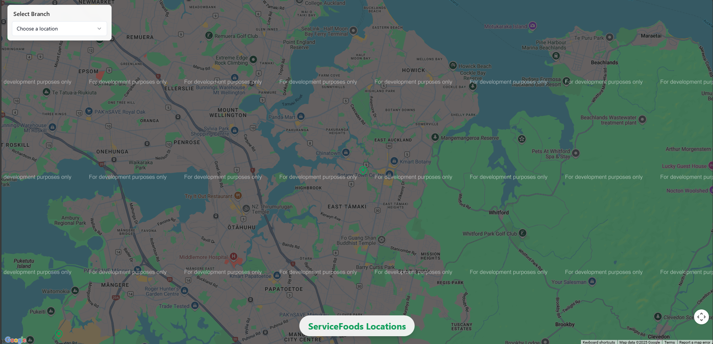

# Kiwi Explorer: New Zealand Interactive Map

An interactive map application for exploring hotspots across New Zealand. [Live Demo](https://kiwi-explorer-map.vercel.app/)

## Screenshots


_Map view showing ServiceFoods locations across New Zealand_


_Detailed view of ServiceFoods locations in Auckland_

## Features

- Full-screen interactive Google Maps integration
- Custom markers for New Zealand hotspots
- Detailed information panels for each location
- Responsive design that works on desktop, tablet, and mobile
- Location selector dropdown
- Animated transitions and UI elements
- Street View integration for selected locations
- Custom marker icons with selection highlighting
- Bounds restriction to New Zealand
- Error handling and user notifications

## Tech Stack

- React.js with TypeScript
- Next.js for server-side rendering
- Google Maps JavaScript API
- Tailwind CSS for styling
- React Google Maps API (@react-google-maps/api)

## Getting Started

### Prerequisites

- Node.js (v14 or later)
- npm or yarn package manager
- Google Maps JavaScript API key

### Installation

1. Clone the repository:

```bash
git clone https://github.com/Web-Dev-Kombee/kiwi-explorer-map.git
cd kiwi-explorer-map
```

2. Install dependencies:

```bash
npm install
```

3. Configure your Google Maps API key:

   - Open `src/config/env.ts`
   - Replace `YOUR_GOOGLE_MAPS_API_KEY` with your actual Google Maps API key

4. Start the development server:

```bash
npm run dev
```

5. Open your browser and navigate to `http://localhost:8080`

## Project Structure

- `src/components/KiwiExplorer.tsx` - Main component that orchestrates the application
- `src/components/MapComponent.tsx` - Handles the Google Maps integration and Street View
- `src/components/InfoPanel.tsx` - Displays information about selected hotspots
- `src/components/HotspotSelector.tsx` - Dropdown for selecting hotspots
- `src/data/hotspots.ts` - Contains the static data for all hotspots
- `src/config/env.ts` - Environment configuration including the Google Maps API key
- `src/hooks/use-toast.ts` - Custom hook for displaying notifications

## Features in Detail

### Map Features

- Interactive Google Maps integration
- Custom marker icons with selection highlighting
- Automatic panning and zooming to selected locations
- Street View integration for supported locations
- New Zealand bounds restriction

### UI Features

- Responsive design for all screen sizes
- Animated transitions for smooth user experience
- Custom toast notifications for errors and updates
- Location selector with search functionality
- Detailed information panels for selected locations

## Adding More Hotspots

To add more hotspots to the map, edit the `src/data/hotspots.ts` file and add new entries following the existing format:

```typescript
{
  name: "Location Name",
  lat: -41.2924,
  lng: 174.7787,
  description: "Location description",
  // ... other properties
}
```

## Obtaining a Google Maps API Key

1. Go to the [Google Cloud Console](https://console.cloud.google.com/)
2. Create a new project or select an existing one
3. Navigate to the "APIs & Services > Dashboard" section
4. Click "+ ENABLE APIS AND SERVICES" and search for "Maps JavaScript API"
5. Enable the Maps JavaScript API
6. Create credentials to get your API key
7. Make sure to restrict the API key to your domain for security

## Contributing

Feel free to submit issues and enhancement requests!

## License

This project is licensed under the MIT License - see the LICENSE file for details.
